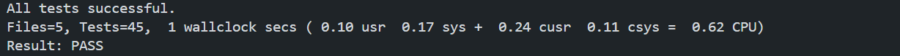

# Testing: what is proven, and where

How to run everything is in the [README Testing section](../README.md#testing). This page lists each rule and the test that proves it.

**Current results (local):** 108 Jest tests in 5 suites pass; 45 pgTAP checks in 5 files pass; `npm run typecheck` is clean.

## Traceability

| Rule or decision | Test that proves it | Layer | CI job |
| ---------------- | ------------------- | ----- | ------ |
| A week runs Monday to Sunday | `week.test.ts` (`getWeekStart` cases, Sunday belongs to the previous Monday, year boundary, 7 consecutive dates across the Melbourne daylight-saving start); `010_pain_constraints` ("week_start is the Monday of the chosen date") | Unit, Database | `unit-tests`, `database-tests` |
| One submission per user per week | `010_pain_constraints` ("a second submission in the same week is rejected"); `030_save_pain_assessment` ("second submission in the same week fails with 23505") | Database | `database-tests` |
| Pain levels follow mildest ≤ current ≤ worst, average between mildest and worst | `010_pain_constraints` ("a worst level below the current level is rejected"); `validate.test.ts` (ordering cases) | Database, Unit | `database-tests`, `unit-tests` |
| Pain levels are required (NOT NULL) | `010_pain_constraints` ("a missing pain level is rejected") | Database | `database-tests` |
| Pain levels are whole numbers from 0 to 10 | `validate.test.ts` (decimal such as 3.5, values below 0 or above 10, NaN) | Unit | `unit-tests` |
| A level of 0 is a real answer, not "missing" | `validate.test.ts` ("accepts 0 as a real answer") | Unit | `unit-tests` |
| Users cannot read each other's pain data | `020_pain_rls` (user A and user B each see only their own pain row) | Database | `database-tests` |
| Users only see their own `users` row | `020_pain_rls` (own `users` row count is 1 for each user) | Database | `database-tests` |
| Every table has row level security | `000_rls_enabled` | Database | `database-tests` |
| The logged-in role has the table privileges it needs, and cannot update or delete pain entries | `025_table_privileges`; `030_save_pain_assessment` (privilege checks) | Database | `database-tests` |
| Saving is atomic: if a child insert fails, no parent row remains | `030_save_pain_assessment` (temporary trigger forces a failure; row count unchanged) | Database | `database-tests` |
| The save function rejects a future date, a date before the start week, a missing profile, no location, no characteristic, a value over 45 characters, and anonymous callers | `030_save_pain_assessment` | Database | `database-tests` |
| Locations are stored in one canonical form (`lower back` becomes `Lower Back`, duplicates collapse, `Other` and 46 characters are rejected) | `normalise.test.ts`; `validate.test.ts` | Unit | `unit-tests` |
| A characteristic must be one of the seven options | `normalise.test.ts` (`isValidCharacteristic`); `validate.test.ts` | Unit | `unit-tests` |
| Database errors map to app error codes (including 23502 to `VALIDATION`) | `errors.test.ts` | Unit | `unit-tests` |
| Saving sends normalised values, and a bad answer never reaches the database | `assessments.test.ts` (`savePainEntry`) | Service | `unit-tests` |
| A retry after a lost response is treated as success; a different stored entry stays `DUPLICATE_WEEK` | `assessments.test.ts` | Service | `unit-tests` |
| Read functions filter by `week_start` and by the signed-in `auth_id`, and report `NO_SESSION` / `NO_PROFILE` | `assessments.test.ts` (`getPainEntryForWeek`, `getCompletedPainWeeks`, `getUserStartWeek`, `getRecentPainLocations`) | Service | `unit-tests` |

## Not automated

These are not covered by an automated test, so no coverage is claimed for them.

- The Finish button cannot be double-submitted (UI behaviour; checked by hand).
- That an untouched slider writes 0 in the UI (the validator accepts 0; the screen itself is checked by hand).
- Screens and components in general: there are no component tests.
- The generated types match the migrations. Checked by hand when the types were generated; not yet a CI step (see below).

## Not tested / deferred

- Formatting check in CI (`prettier --check`): the repository has mixed line endings, so it would fail on most existing files.
- `npm run lint` in CI: it currently fails on two existing errors (`app/(auth)/consent.tsx`, `src/constants/theme.ts`), so it is left out until those are fixed.
- Deploy pipeline, EAS builds, branch protection and required checks.
- UI component tests.
- Coverage thresholds. The coverage report is produced and uploaded by CI, but nothing fails on a percentage.

## Evidence

Database tests passing (45 checks across 5 files):

- Unit tests passing: **TODO**, screenshot of `npm test` to be saved as `docs/screenshots/unit-tests-passing.png`.
- Green CI checks on a pull request: **TODO**, `docs/screenshots/ci-green.png`.
- GitHub Actions run page: **TODO**, `docs/screenshots/ci-run.png`.
